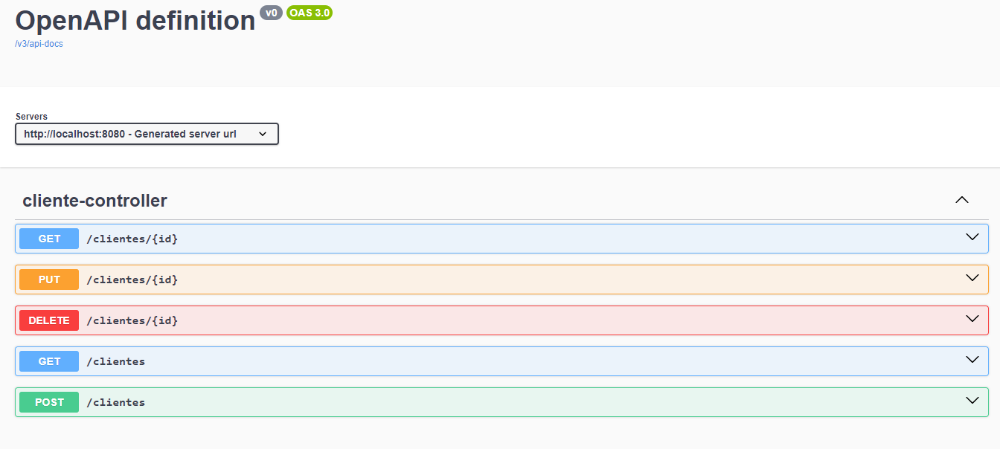

# Projeto do Módulo - Explorando Padrões de Projetos na Pratica com Java e Spring Boot.

## Descrição

Projeto desenvolvido durante o módulo: Explorando Padrões de Projetos na Pratica com Java e Spring Boot, do Bootcamp [Java AI Powered](https://www.dio.me/bootcamp/coding-future-tonnie-java-ai-powered).

## Desafio

Agora é a sua hora de brilhar! Crie uma solução que
explore o conceito de Padrões de Projeto na prática.
Para isso, você pode reproduzir um dos projetos que
criamos durante as aulas ou, caso se sinta preparado,
desenvolver uma nova ideia do zero ;-)

**Dica**: Além dos projetos/repositórios que criamos para este desafio, caso queira
explorar novos padrões de projeto digite no Google: "java design patterns github"
ou "java design patterns examples". Com isso, você conhecerá novos padrões e
implementações de referência que podem ajudá-lo a dominar esse tema!

## Tecnologias


## Padrões de Projeto abordados

- **Strategy**: Define uma família de algoritmos, encapsula cada um deles e os torna intercambiáveis. A estratégia permite que o algoritmo varie independentemente dos clientes que o utilizam.
- **Singleton**: Garante que uma classe tenha apenas uma instância e fornece um ponto de acesso global para ela.
- **Facade**: Fornece uma interface unificada para um conjunto de interfaces em um subsistema. O Facade define uma interface de nível mais alto que torna o subsistema mais fácil de usar.
- **DTO**: Objeto de Transferência de Dados (DTO) é um padrão de design que é usado para transferir dados entre subsistemas de um software. DTOs são frequentemente usados em conjunção com objetos de acesso a dados para obter dados de um banco de dados.
- **Builder**: O padrão Builder é um padrão de design de software que permite a separação da construção de um objeto complexo de sua representação, de modo que o mesmo processo de construção possa criar diferentes representações.

## Endpoints

Após baixar e executar o projeto, você pode acessar a documentação dos endpoints através do Swagger, acessando a URL: 
```http 
http://localhost:8080/swagger-ui.html
```

